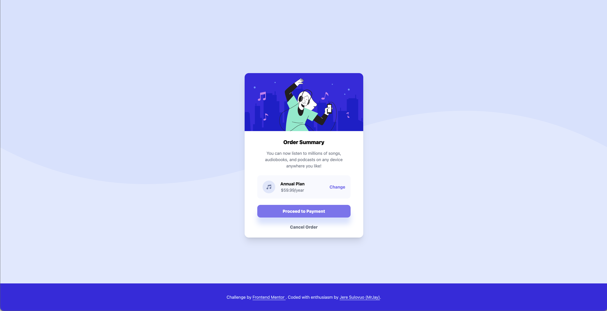

# Frontend Mentor - Order summary card solution

This is my solution to the [Order summary card challenge on Frontend Mentor](https://www.frontendmentor.io/challenges/order-summary-component-QlPmajDUj). Frontend Mentor challenges help you improve your coding skills by building realistic projects. 

## Table of contents

- [Overview](#overview)
  - [The challenge](#the-challenge)
  - [Screenshot](#screenshot)
  - [Links](#links)
- [My process](#my-process)
  - [Built with](#built-with)
  - [What I learned](#what-i-learned)
  - [Continued development](#continued-development)
- [Author](#author)

## Overview

### The challenge

Users should be able to:

- See hover states for interactive elements

### Screenshot

### Links

- Solution URL: [Github](https://github.com/chungvuiloong/order-summary-component)
- Live Site URL: [Vercel](https://mrjays-order-summary-component.vercel.app/)

## My process
- First the given image was analysed and broken down into several portions (Body, Card, Footer).
- Body as container to be set at relative, flex, flex-col, and justify-center which vertically centers the content. 
  - Purple background. To make this full screen, height of body container is set to 100vh to be full screen. Because it is fullscreen, purple background will be full screen as well. 
  - Purple wave image. Due to relative class in body container, purple wave can be set at the top via css classses, absolute, top-0 and width fill to the size of screen width.
- Card component is set with flex and flex-col to make all the content in column format. Overflow is added to ensure image in card doesn't overflow. The contents are broken down into portions:
  - Image header. 
  - Contents. This acts a container. It is set to be flex, flex-col so that all content is in a column. Gap is provided each content an equal space.
  - Title & Paragraph
  - Annual plan. This set to be flex and flex-row to make content in a row format.
  - Buttons. Both buttons has been given a hover effect according to the given images.
- Footer component. This component is recycled and reused from previous challenges.
- Once everything is done, I would finalise the project and check for any potential irregularities.
  
### Built with

- Semantic HTML5 markup
- Tailwind CSS
- Material Tailwind
- Flexbox
- Mobile-first workflow

### What I learned

As I used a mobile first approach, the desktop view was not focused on. At the desktop view, the order summary component expanded to the full screen. To fix this, max-w-[sizepx] was used.

### Continued development

Using this summary component, I am hoing to incorporate it into my future projects. At the same time, I am looking forward to feedback to further improve this.

**Note: Delete this note and the content within this section and replace with your own plans for continued development.**

## Author

- Website - [MrJay's Simple Portfolio](https://mrjays-simple-portfolio.vercel.app/)
- Github - [Jere / Chung Vui Loong](https://github.com/chungvuiloong)